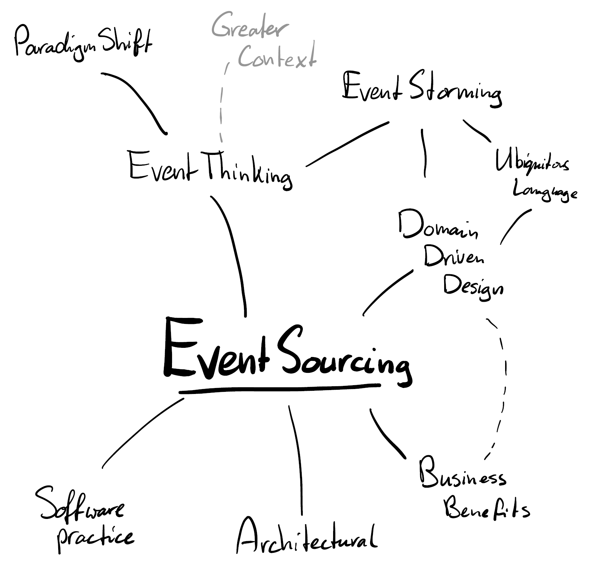
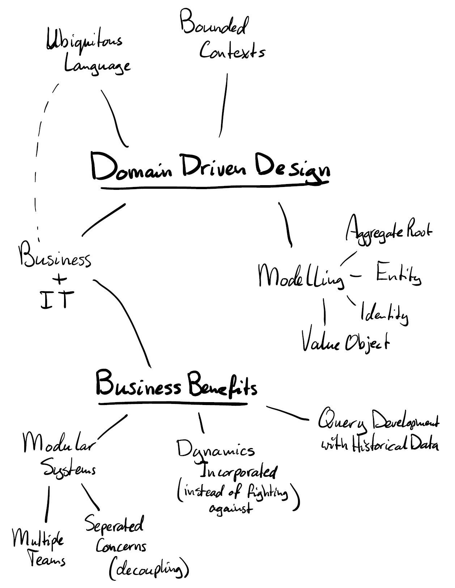
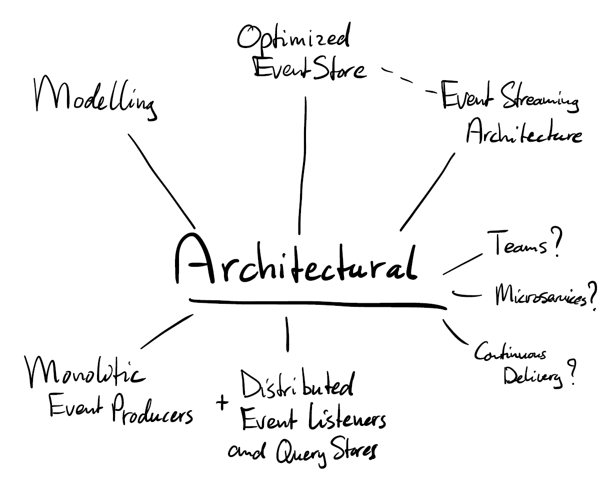
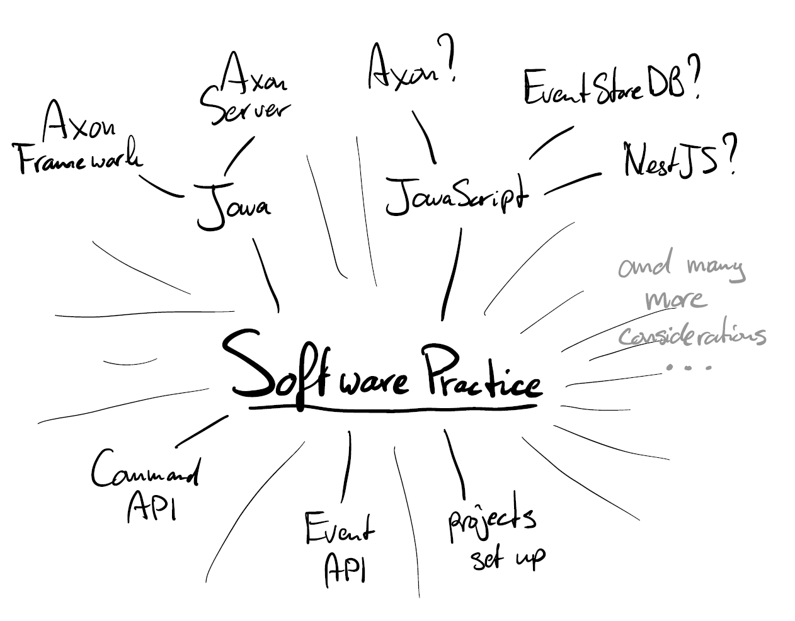

# Event Sourcing

There's a lot to say about Event Sourcing and Event Driven Architecture.
You could say that there are also multiple layers to talk about or explain.

This mindmap describes the full context (although it does not pretend to be fully complete).

## Thinking in Events

The first step is to 'think in Events'.
This is what 'Event Thinking' is addressing.
And ... it often seems to be a paradigm shift from our current views on systems.
Explainable and understandable but still ... be prepared to step out of your comfort zone and stretch your way of thinking.

| FROM                                        | TO                                                                                                                                 |
| ------------------------------------------- | ---------------------------------------------------------------------------------------------------------------------------------- |
| One language for the Final State Model only | Command language, (internal) State Transition Language and (at least) One Query State language and Model                           |
| Static State Model                          | Modelling dynamics with Commands and Events                                                                                        |
| Single State Model                          | Multiple Query Models (optimization at the Service Provider side or even only expose Events and let the Consumers optimize ...) |

To address these paradigm shifts or the start thinking in Events take the following steps:

1. Start with understanding Commands, Events and Queries
2. Do Event Storming
3. Take dynamics as a starting point (instead of static state data)
4. Think about and design the origin of decisions (where events are the proof of those decisions)
5. Impact of records decisions (aka Events) are Query Stores being Views or Projections or they can be used as Triggers for 'downstream' processes

Taking about languages and the explicitness of them is coming from the world of Domain Driven Design.
A _ubiquitous_ language is what is strived for.
Everybody understands the same meaning and interpretation of all verbs and nouns of the Domain.
And a few more things can be learned from this practice.

Secondly there are business benefits (besides others) to Domain Driven Design and Thinking in Events.

Now we are Thinking in Events, it is time to dive a little deeping into Event Sourcing.
Let's dive into the [Architectural](#architecture-of-event-sourcing) aspects of it.

## Architecture of Event Sourcing

> // TODO

## Software Practices of Event Sourcing

> // TODO

